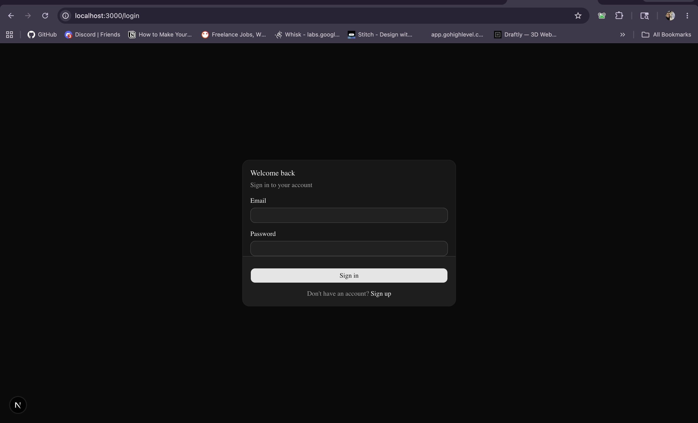
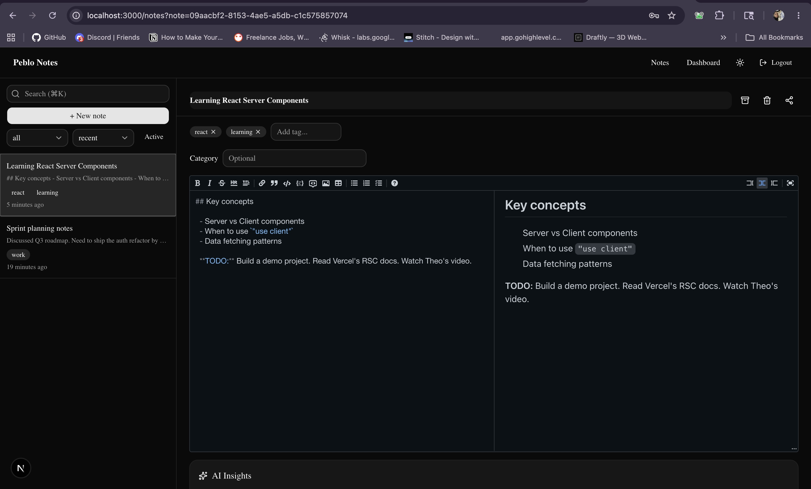
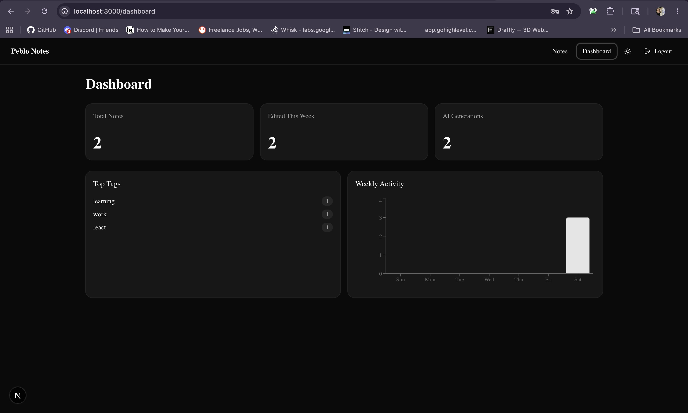
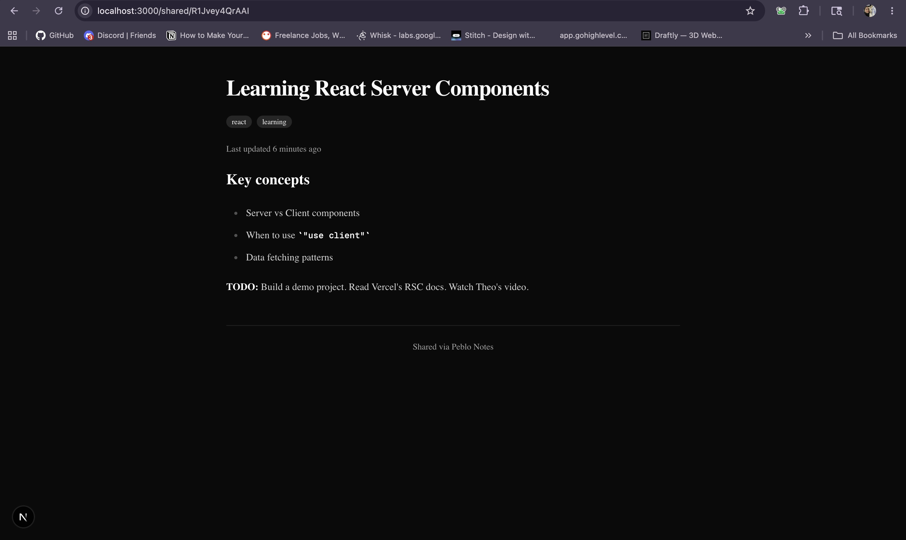

# AI Prompt History

Peblo Notes was built with Claude Code (Opus 4.7, 1M context) over 25 prompts in a single session, from empty directory to deployed Vercel app.

This file lists every prompt I gave the model, verbatim. Each entry has a one-line summary and the original text.

Where the model paused to ask a clarifying question (e.g. how to handle the Supabase DB password, how to break ties on Gemini model names, how to recover from a truncated paste), I answered via Claude Code's interactive question UI. Those one-click answers are not separate prompts and aren't listed below; they're noted inline where relevant.

---

## 1. Scaffold the Next.js project

````
Create a Next.js 14 project in the current empty directory with this exact setup:

1. Run: npx create-next-app@latest . --typescript --tailwind --eslint --app --src-dir --import-alias "@/*" --no-turbopack
   - Answer "No" to any extra prompts
   - The "." means current directory

2. Install dependencies:
   npm install @supabase/supabase-js @supabase/ssr @google/generative-ai zod nanoid lucide-react sonner date-fns recharts @uiw/react-md-editor react-markdown next-themes @tailwindcss/typography

3. Install dev dependencies:
   npm install -D supabase

4. Set up shadcn/ui:
   npx shadcn@latest init -d
   Then add these components:
   npx shadcn@latest add button input textarea card dialog dropdown-menu badge tabs separator skeleton sonner sheet label select

5. Create this folder structure (empty folders with .gitkeep files):
   src/app/(auth)/login
   src/app/(auth)/signup
   src/app/(app)/notes
   src/app/(app)/dashboard
   src/app/shared/[shareId]
   src/app/api/notes
   src/app/api/notes/[id]
   src/app/api/notes/[id]/ai
   src/app/api/notes/[id]/share
   src/app/api/shared/[shareId]
   src/app/api/insights
   src/lib/supabase
   src/components
   src/types
   supabase/migrations
   samples/screenshots

6. Create .env.example at project root with:
   NEXT_PUBLIC_SUPABASE_URL=
   NEXT_PUBLIC_SUPABASE_ANON_KEY=
   SUPABASE_SERVICE_ROLE_KEY=
   GEMINI_API_KEY=

7. Verify .gitignore includes: .env, .env.local, .env*.local, node_modules, .next, supabase/.temp, supabase/.branches

8. Initialize git, make first commit "chore: scaffold project"

Do NOT start the dev server. Stop after the commit and show me a summary of what was created.
````

> The directory already had a Next.js 16.2.6 scaffold (not 14). I asked via clarifying question and the user picked "Keep Next.js 16 scaffold", so step 1 was skipped.

---

## 2. Create .env.local with placeholder values

````
Create a .env.local file at the project root by copying .env.example. Fill it with placeholder values that I'll replace manually.

Content of .env.local:

NEXT_PUBLIC_SUPABASE_URL=https://YOUR_PROJECT_REF.supabase.co
NEXT_PUBLIC_SUPABASE_ANON_KEY=paste_anon_key_here
SUPABASE_SERVICE_ROLE_KEY=paste_service_role_key_here
GEMINI_API_KEY=paste_gemini_key_here
NEXT_PUBLIC_SITE_URL=http://localhost:3000

After creating it:
1. Verify .env.local is listed in .gitignore (it should already be)
2. Run: git status — confirm .env.local does NOT appear in tracked files
3. Print the file path so I can open it and fill in real values
4. Do NOT commit this file

Stop after that. I'll fill in the real values myself.
````

---

## 3. Supabase CLI integration and initial schema

````
Set up Supabase CLI integration and push the initial schema.

I've already created the project on supabase.com. My Project Reference ID is: jkmnsngbnxrxlkccjeau


1. Initialize Supabase locally: npx supabase init
   - This creates supabase/config.toml
   - Do NOT start the local Docker stack

2. Link to the hosted project: npx supabase link --project-ref jkmnsngbnxrxlkccjeau

   - It will prompt for the database password — I'll enter it interactively in the terminal

3. Create supabase/migrations/0001_initial_schema.sql with this exact content:

create table notes (
  id uuid primary key default gen_random_uuid(),
  user_id uuid not null references auth.users(id) on delete cascade,
  title text not null default 'Untitled',
  content text not null default '',
  tags text[] not null default '{}',
  category text,
  is_archived boolean not null default false,
  is_public boolean not null default false,
  share_id text unique,
  ai_summary text,
  ai_action_items jsonb,
  ai_suggested_title text,
  ai_last_generated_at timestamptz,
  created_at timestamptz not null default now(),
  updated_at timestamptz not null default now()
);

create table ai_usage (
  id uuid primary key default gen_random_uuid(),
  user_id uuid not null references auth.users(id) on delete cascade,
  note_id uuid references notes(id) on delete set null,
  operation text not null,
  created_at timestamptz not null default now()
);

create index notes_user_id_idx on notes(user_id);
create index notes_updated_at_idx on notes(updated_at desc);
create index notes_share_id_idx on notes(share_id) where share_id is not null;
create index ai_usage_user_id_idx on ai_usage(user_id);

alter table notes enable row level security;
alter table ai_usage enable row level security;

create policy "users read own notes" on notes for select using (auth.uid() = user_id);
create policy "users insert own notes" on notes for insert with check (auth.uid() = user_id);
create policy "users update own notes" on notes for update using (auth.uid() = user_id);
create policy "users delete own notes" on notes for delete using (auth.uid() = user_id);
create policy "public read shared notes" on notes for select using (is_public = true and share_id is not null);

create policy "users read own ai_usage" on ai_usage for select using (auth.uid() = user_id);
create policy "users insert own ai_usage" on ai_usage for insert with check (auth.uid() = user_id);

create or replace function update_updated_at()
returns trigger as $$
begin new.updated_at = now(); return new; end;
$$ language plpgsql;

create trigger notes_updated_at before update on notes
for each row execute function update_updated_at();

create or replace function get_top_tags(uid uuid, limit_count int default 5)
returns table(tag text, count bigint) as $$
  select unnest(tags) as tag, count(*) as count
  from notes
  where user_id = uid and is_archived = false
  group by tag
  order by count desc
  limit limit_count;
$$ language sql security definer;

4. Push the migration: npx supabase db push
   - Confirm when prompted

5. Generate TypeScript types: npx supabase gen types typescript --linked > src/types/supabase.ts

6. Verify with: npx supabase migration list --linked

7. Commit as "feat: supabase schema and types"

Stop and ask me for the project ref before running step 2. Run steps interactively so I can enter the DB password when prompted.
````

> The Bash tool runs commands non-interactively, so I couldn't pipe the DB password. I asked how to handle it; the user picked "You run link/push in your terminal" and ran them locally.

---

## 4. Continue Supabase steps 5–7 after manual link/push

````
Done. Link and push completed successfully. Continue with steps 5, 6, 7 from the supabase setup prompt:

5. Generate TypeScript types: npx supabase gen types typescript --linked > src/types/supabase.ts
6. Verify with: npx supabase migration list --linked
7. Commit as "feat: supabase schema and types"
````

> `gen types --linked` needs a Supabase access token (different from the DB password). The user opted to run `gen types` and the verification themselves with their already-exported `SUPABASE_ACCESS_TOKEN`, then paste the output back.

---

## 5. Continue with the commit step after gen types

````
Done. Output:

- gen types created src/types/supabase.ts (274 lines)
- migration list shows Local 0001 = Remote 0001 (synced)
- head of supabase.ts confirms Database type is exported

Continue with step 7: commit as "feat: supabase schema and types"
````

---

## 6. Delete the now-redundant migrations .gitkeep

````
Also delete supabase/migrations/.gitkeep — the migration file is there now, .gitkeep is no longer needed and the CLI keeps warning about it.
````

---

## 7. Commit the deletion and push both commits to origin

````
Commit it as "chore: remove migrations .gitkeep" then push both commits to origin/main.
````

---

## 8. Supabase clients + middleware + api helpers

````
Set up Supabase client utilities and route protection middleware.

1. Create src/lib/supabase/client.ts:
   - Browser client using createBrowserClient from @supabase/ssr
   - Typed with Database from src/types/supabase.ts
   - Reads from process.env.NEXT_PUBLIC_SUPABASE_URL and NEXT_PUBLIC_SUPABASE_ANON_KEY
   - Export as createClient() function

2. Create src/lib/supabase/server.ts:
   - Server client using createServerClient from @supabase/ssr
   - Uses cookies() from next/headers for cookie store
   - Handle get/set/remove with try-catch around set/remove (set can throw in Server Components, that's expected — silently ignore)
   - Typed with Database
   - Export as createClient() async function

3. Create src/lib/supabase/admin.ts:
   - Service-role client using createClient from @supabase/supabase-js (NOT @supabase/ssr — no cookies needed)
   - Uses SUPABASE_SERVICE_ROLE_KEY (server-only, never imported by client components)
   - Configure with auth: { autoRefreshToken: false, persistSession: false }
   - Typed with Database
   - Add a comment at the top: "// SERVER-ONLY: never import from client components"

4. Create middleware.ts at project root:
   - Use createServerClient from @supabase/ssr with proper cookie handling for NextResponse
   - Call supabase.auth.getUser() to refresh the session on every request
   - Define protected route prefixes: ['/notes', '/dashboard']
   - Define auth route prefixes: ['/login', '/signup']
   - If no user AND pathname starts with a protected prefix: redirect to /login
   - If user EXISTS AND pathname starts with an auth prefix: redirect to /notes
   - Return the response with refreshed cookies
   - Export config with matcher that excludes: _next/static, _next/image, favicon.ico, api/shared (public), and image extensions

5. Create src/lib/api-helpers.ts:
   - Custom error classes: UnauthorizedError, NotFoundError, ValidationError (each extends Error with a status property)
   - export async function getUser() — gets server client, calls auth.getUser(), throws UnauthorizedError if no user, returns user
   - export function handleApiError(error: unknown): NextResponse — maps error types to status codes, logs to console.error, returns { error: message } JSON
   - Wrap zod validation: export function parseBody<T>(schema: ZodSchema<T>, body: unknown): T — throws ValidationError on failure with the zod error message

6. Run: npm run build
   Fix any TypeScript errors. Common ones:
   - cookie types in middleware — use the proper request/response cookie methods
   - Database type generic — must be passed to createClient calls

7. Commit as "feat: supabase clients, middleware, api helpers" then push.
````

> Two deviations: `@supabase/ssr` 0.5+ deprecated `get/set/remove` in favor of `getAll/setAll` — used the modern API. With Next 16 + src-dir, middleware must live at `src/middleware.ts`, not the repo root.

---

## 9. Rename middleware.ts to proxy.ts for Next 16

````
We're on Next.js 16.2.6. Rename src/middleware.ts to src/proxy.ts since middleware.ts is deprecated in Next 16. 

1. git mv src/middleware.ts src/proxy.ts
2. Check the file contents — if the exported config or function references "middleware" by name internally (function signature, type imports), update accordingly. The matcher config stays the same.
3. Run: npm run build
   Fix any errors. If the build complains about the rename, check Next 16 docs for the exact proxy.ts export shape.
4. Run: npm run dev briefly (5 seconds) to confirm no deprecation warnings about middleware.ts in the console. Then stop it.
5. Commit as "chore: rename middleware to proxy for Next 16" and push.
````

---

## 10. Build the authentication UI

````
Build the authentication UI.

1. Replace src/app/page.tsx (currently the Next.js default starter) with a server component that:
   - Gets the server supabase client and calls auth.getUser()
   - If user exists: redirect("/notes")
   - If no user: redirect("/login")
   - Use redirect() from next/navigation
   - No JSX needed — just the redirect logic

2. src/app/(auth)/layout.tsx — minimal centered layout: min-h-screen, flex items-center justify-center, bg-background, p-4. Inside: max-w-md w-full container.

3. src/app/(auth)/login/page.tsx:
   - Client component (top: "use client")
   - State: email, password, isLoading
   - shadcn Card with CardHeader (title "Welcome back", description "Sign in to your account"), CardContent with form, CardFooter with link to signup
   - Inputs: email (type="email", required) with Label, password (type="password", min 6) with Label
   - Validate with zod inline before submit
   - On submit: setIsLoading(true), call supabase.auth.signInWithPassword({ email, password })
   - On error: toast.error(error.message) from sonner, setIsLoading(false)
   - On success: router.push("/notes"), then router.refresh()
   - Submit button full width: disabled when isLoading, shows "Signing in..." while loading, else "Sign in"
   - CardFooter: "Don't have an account?" with link to /signup

4. src/app/(auth)/signup/page.tsx:
   - Same structure as login
   - Title "Create your account", description "Get started with Peblo Notes"
   - Calls supabase.auth.signUp({ email, password })
   - On success: router.push("/notes"), then router.refresh()
   - CardFooter: "Already have an account?" Link to /login

5. src/components/logout-button.tsx:
   - Client component
   - shadcn Button variant="ghost" size="sm"
   - LogOut icon from lucide-react, gap-2
   - onClick: await supabase.auth.signOut(), router.push("/login"), router.refresh()
   - Text: "Logout"

6. Add Sonner Toaster to src/app/layout.tsx:
   - import { Toaster } from "sonner"
   - Add <Toaster richColors position="top-right" /> inside <body> after {children}

7. Update src/app/layout.tsx metadata:
   - title: { default: "Peblo Notes", template: "%s | Peblo Notes" }
   - description: "AI-powered notes workspace"

8. Delete the default public/vercel.svg and public/next.svg if they're not imported anywhere. Also delete any imports of those from the previous src/app/page.tsx (which you're replacing).

9. Run npm run build — fix any errors.

10. Commit as "feat: auth pages" and push.
````

---

## 11. Build the notes/share API

````
Build all notes-related API routes. Use the server Supabase client and rely on RLS for authorization.

1. src/app/api/notes/route.ts:
   - GET handler: parse query params archived (default "false"), tag, q (search), sort ("recent"|"oldest"|"title", default "recent"). Build query:
     - Base: supabase.from("notes").select("*")
     - Filter: .eq("is_archived", archived === "true")
     - If q: .or(`title.ilike.%${q}%,content.ilike.%${q}%`)
     - If tag: .contains("tags", [tag])
     - Sort: recent → .order("updated_at", { ascending: false }); oldest → .order("updated_at", { ascending: true }); title → .order("title", { ascending: true })
   - Return { notes: data }
   - POST handler: no body needed. Insert { user_id: user.id } with defaults. Return { note: data }.

2. src/app/api/notes/[id]/route.ts:
   - GET: fetch single note by id, return { note }. 404 if not found.
   - PATCH: parse body with zod schema (title?: string, content?: string, tags?: string[], category?: string | null, is_archived?: boolean). Update by id. Return updated note.
   - DELETE: delete by id, return { ok: true }.
   - Use NextRequest with { params }: { params: Promise<{ id: string }> } for Next 16 — await params before use.

3. src/app/api/notes/[id]/share/route.ts:
   - POST: fetch note. If share_id already exists and is_public is true, return { share_id, share_url } using NEXT_PUBLIC_SITE_URL. Else: generate nanoid(12), update note with share_id and is_public=true, return { share_id, share_url }.
   - DELETE: update note to set is_public=false, share_id=null. Return { ok: true }.

4. src/app/api/shared/[shareId]/route.ts:
   - GET: PUBLIC, no auth. Use createClient from @supabase/supabase-js (NOT @supabase/ssr — no cookies) with anon key.
   - Query: .from("notes").select("title, content, tags, updated_at").eq("share_id", shareId).eq("is_public", true).single()
   - Return only those fields. 404 if not found.
   - Never expose user_id or other fields.

5. Add NEXT_PUBLIC_SITE_URL=http://localhost:3000 to .env.example and confirm it's in .env.local (already there from earlier).

6. Wrap every handler in try/catch using handleApiError() from src/lib/api-helpers.ts.

7. Run npm run build — fix any TypeScript errors (especially around Next 16 async params).

8. Commit as "feat: notes and share API" and push.
````

---

## 12. Gemini AI integration with caching

````
Build Gemini AI integration with caching and graceful failures.

1. src/lib/ai.ts:
   - "use server" is NOT needed (lib file, only imported by route handlers)
   - import { GoogleGenerativeAI, SchemaType } from "@google/generative-ai"
   - Initialize: const genAI = new GoogleGenerativeAI(process.env.GEMINI_API_KEY!)
   - Export an interface NoteInsights { summary: string; action_items: string[]; suggested_title: string }
   - Export async function generateNoteInsights(content: string): Promise<NoteInsights>:
     - Truncate: const truncated = content.slice(0, 8000)
     - Define schema with SchemaType.OBJECT, properties: summary (STRING), action_items (ARRAY of STRING), suggested_title (STRING). All required.
     - const model = genAI.getGenerativeModel({ model: "gemini-2.0-flash", generationConfig: { responseMimeType: "application/json", responseSchema: schema } })
     - Prompt:
       """
       You are a notes assistant. Analyze the note below and return JSON with three fields:
       - summary: 2-3 sentences capturing the core idea
       - action_items: array of concrete tasks mentioned in the note (empty array if none)
       - suggested_title: a 3-7 word title that captures the essence
       
       Note content:
       """
       {truncated}
       """
       """
     - const result = await model.generateContent(prompt)
     - const text = result.response.text()
     - Parse with zod (NoteInsights schema) for runtime safety
     - On parse error: throw new Error("AI returned invalid output")
     - Return the parsed result

2. src/app/api/notes/[id]/ai/route.ts:
   - POST handler with body schema z.object({ force: z.boolean().optional() })
   - Steps:
     a. await getUser()
     b. await params for { id }
     c. Parse body (allow empty body → force defaults to false)
     d. Fetch note: supabase.from("notes").select("content, updated_at, ai_summary, ai_action_items, ai_suggested_title, ai_last_generated_at").eq("id", id).maybeSingle()
     e. If !note: throw NotFoundError
     f. Check cache: if !force AND note.ai_last_generated_at AND new Date(note.ai_last_generated_at) >= new Date(note.updated_at) AND note.ai_summary:
        Return { summary: note.ai_summary, action_items: note.ai_action_items, suggested_title: note.ai_suggested_title, cached: true }
     g. Otherwise generate: try { const insights = await generateNoteInsights(note.content) } catch: return NextResponse.json({ error: "AI generation failed, please try again" }, { status: 502 })
     h. Update note row with the three ai_* fields and ai_last_generated_at = new Date().toISOString()
     i. Insert into ai_usage: { user_id: user.id, note_id: id, operation: "all" }
     j. Return { ...insights, cached: false }

3. src/app/api/insights/route.ts:
   - GET handler, returns dashboard stats
   - await getUser()
   - Run these queries (can be parallel with Promise.all):
     - total_notes: from("notes").select("id", { count: "exact", head: true }).eq("user_id", user.id).eq("is_archived", false) — use the count, not data
     - notes_edited_this_week: same but add .gte("updated_at", sevenDaysAgo)
     - ai_usage_count: from("ai_usage").select("id", { count: "exact", head: true }).eq("user_id", user.id)
     - top_tags: supabase.rpc("get_top_tags", { uid: user.id, limit_count: 5 }) — returns [{ tag, count }]
     - weekly_activity: fetch notes updated in last 7 days (select updated_at, .gte("updated_at", sevenDaysAgo)), then in JS group by YYYY-MM-DD and fill in zeros for missing days. Output: [{ date: "2026-05-10", count: 3 }, ...] for last 7 days in chronological order.
   - Return all as one JSON object.

4. Run npm run build — fix TS errors. Common ones:
   - SchemaType import — make sure it comes from @google/generative-ai
   - Database type generic on rpc call may need explicit typing if get_top_tags isn't in the generated types

5. Verify .env.local has GEMINI_API_KEY set with a real key.

6. Commit as "feat: AI integration and insights API" and push.
````

---

## 13. Make the ai_usage insert non-fatal

````
In src/app/api/notes/[id]/ai/route.ts, make the ai_usage insert non-fatal. If it fails, log the error to console.error but don't throw — the user already got their insights, logging failures shouldn't 502 them. Replace the existing `if (usageError) throw usageError` with a console.error call.

Also add a single sentence comment above the insert explaining why it's non-fatal.

Run npm run build to confirm clean, then commit as "fix: make ai_usage insert non-fatal" and push.
````

---

## 14. Build the notes workspace (initial — spec truncated mid-AI-section)

> This prompt arrived as an interrupt during the previous fix; it cut off at "AI insights section ... If no". I finished the current task, then paused and asked the user to re-paste the truncated remainder.

````
Build the main notes workspace at /notes. This is the largest piece of the app.

Layout: two columns. Left sidebar 320px (notes list). Right pane is the editor.

1. src/app/(app)/layout.tsx (server component):
   - Get user via getUser() helper or directly via supabase server client
   - If no user: redirect("/login")
   - Top bar (sticky, h-14, border-b, bg-background): logo/title "Peblo Notes" on left as Link to /notes. Right side: nav Links "Notes" (/notes) and "Dashboard" (/dashboard), ThemeToggle, LogoutButton
   - Below: <main className="flex-1">{children}</main>
   - Use a flex column container min-h-screen

… [truncated mid-AI-insights spec at "If no"] …
````

---

## 15. Full notes workspace spec (re-paste from "AI insights section" with full file)

````
Continuing from "AI insights section" — here's the full spec for the notes workspace UI.

Pick up from where the previous prompt cut off. Build all of these from scratch, in this order.

1. src/app/(app)/layout.tsx (server component):
   - Get user via getUser() helper. If no user: redirect("/login").
   - Top bar: sticky, h-14, border-b, bg-background, flex items-center justify-between, px-6
     - Left: Link to /notes with text "Peblo Notes" (font-semibold)
     - Right: nav with Link "Notes" (/notes) and "Dashboard" (/dashboard) both with text-sm, then ThemeToggle, then LogoutButton
   - Main: <main className="flex-1">{children}</main>
   - Outer container: flex flex-col min-h-screen

2. src/components/theme-provider.tsx ("use client"):
   - Re-exports ThemeProvider from next-themes with default attributes attribute="class" defaultTheme="system" enableSystem disableTransitionOnChange

3. src/components/theme-toggle.tsx ("use client"):
   - useState mounted = false, useEffect setMounted(true)
   - If !mounted: return null
   - shadcn Button variant="ghost" size="icon"
   - Show Sun icon when resolvedTheme === "dark", Moon icon otherwise (lucide-react Sun, Moon)
   - onClick: setTheme(resolvedTheme === "dark" ? "light" : "dark")

4. Update src/app/layout.tsx:
   - <html lang="en" suppressHydrationWarning>
   - Wrap {children} in <ThemeProvider> from @/components/theme-provider
   - Keep <Toaster richColors position="top-right" /> inside body

5. src/app/(app)/notes/page.tsx ("use client"):
   - Wrap the page content in <Suspense> because useSearchParams requires it in Next 16. Pattern:
     - Default export a page component that returns <Suspense fallback={<div className="p-6">Loading...</div>}><NotesPageContent /></Suspense>
     - NotesPageContent has the real logic
   - State in NotesPageContent: notes, selectedId, search, tagFilter, sort, showArchived, loading
   - On mount: read ?note=ID from useSearchParams, set selectedId
   - useEffect fetches GET /api/notes with query params built from filters; runs on filter changes (debounced 300ms for search)
   - On any state change to filters: router.replace(`/notes?${params}`, { scroll: false }) to keep URL in sync. Include note=selectedId if set.
   - refreshNotes(): re-fetch /api/notes with current filters
   - selectedNote = notes.find(n => n.id === selectedId) || null
   - Render: <div className="flex h-[calc(100vh-3.5rem)]"><NotesSidebar ... /><div className="flex-1 overflow-hidden"><NoteEditor ... /></div></div>

6. src/components/notes-sidebar.tsx ("use client"):
   - Props: notes, selectedId, onSelect, search, setSearch, tagFilter, setTagFilter, sort, setSort, showArchived, setShowArchived, onCreate (function)
   - Container: w-80 border-r flex flex-col h-full
   - Sticky header (p-3, border-b, space-y-2):
     - Search Input with Search icon prefix. Ref + keydown listener on window for Cmd+K / Ctrl+K calling ref.current?.focus(). Bind value to search.
     - "+ New note" Button variant="default" className="w-full". onClick: onCreate(). Window keydown listener for Cmd+N / Ctrl+N calls onCreate(). preventDefault to stop browser "new window".
     - Filter row (flex gap-2): 
       - Tag Select (shadcn Select) — options: { value: "all", label: "All tags" } plus unique tags from notes. Bind to tagFilter; "all" maps to null.
       - Sort Select — Recent / Oldest / Title A-Z, bound to sort.
       - Archived toggle Button variant="ghost" size="sm" — text "Archived" if showArchived else "Active". Click toggles.
   - Scrollable list (overflow-y-auto flex-1):
     - If notes.length === 0: <div className="p-6 text-center text-sm text-muted-foreground">No notes yet. Press ⌘N to create one.</div>
     - Else map notes to <button> (so it's keyboard accessible) with className depending on selected: w-full text-left p-3 border-b hover:bg-accent {selectedId === note.id ? "bg-accent" : ""}
       - Inside: 
         - div font-medium truncate text-sm: note.title || "Untitled"
         - div text-xs text-muted-foreground truncate mt-1: note.content?.slice(0, 80) || "No content"
         - flex flex-wrap gap-1 mt-2: tags.slice(0, 3) as <Badge variant="secondary" className="text-xs">{tag}</Badge>
         - div text-xs text-muted-foreground mt-1: formatDistanceToNow(new Date(note.updated_at), { addSuffix: true })

7. src/components/note-editor.tsx ("use client"):
   - Props: note (Note | null), onUpdate (() => void to refresh parent), onDelete (() => void after delete)
   - If !note: <div className="flex h-full items-center justify-center text-muted-foreground">Select a note or create a new one</div>
   - Local state initialized from note: title, content, tags, category, isArchived. useEffect resets local state when note.id changes (handles switching notes).
   - Status state: "idle" | "saving" | "saved", lastSavedAt (Date | null)
   - Auto-save effect:
     - useEffect watches [title, content, tags, category, isArchived]
     - dirtyRef = useRef(false) — skip first run when note is loaded
     - Set status to "saving" immediately on change
     - setTimeout 1500ms PATCHes /api/notes/[note.id] with the fields. On success: setStatus("saved"), setLastSavedAt(new Date()), call onUpdate()
     - Clear timeout on next change (typical debounce pattern)
   - Container: flex flex-col h-full
   - Header row (p-6 pb-3 flex items-center gap-2 border-b):
     - Title Input: type="text", className="text-2xl font-bold border-0 shadow-none focus-visible:ring-0 px-0 flex-1", placeholder "Untitled"
     - Status indicator: small text-xs text-muted-foreground. "Saving..." when status === "saving". "Saved" + relative time when "saved". Empty when "idle".
     - Toolbar buttons:
       - Archive/Unarchive: Button variant="ghost" size="icon" with Archive icon — onClick toggles isArchived
       - Delete: Button variant="ghost" size="icon" with Trash2 icon — opens AlertDialog. Confirm calls DELETE /api/notes/[note.id], then onDelete()
       - Share: <ShareDialog note={note} onChange={onUpdate} /> — the dialog component renders its own trigger Button
   - Body (p-6 pt-3 overflow-y-auto flex-1 space-y-4):
     - Tags row: flex flex-wrap gap-2 items-center
       - For each tag: Badge variant="secondary" with X button inside (onClick removes tag)
       - Then Input with placeholder "Add tag...", w-32 inline. onKeyDown: if key === "Enter" or "," → e.preventDefault, trim value, add to tags if not empty and not duplicate, clear input
     - Category Input: small inline input labeled "Category" (use a Label + Input combo with className max-w-xs)
     - Markdown editor: 
       - At top of file: const MDEditor = dynamic(() => import("@uiw/react-md-editor").then(mod => mod.default), { ssr: false })
       - Import the dark mode CSS at top of layout: import "@uiw/react-md-editor/markdown-editor.css"; import "@uiw/react-markdown-preview/markdown.css";
       - Render: <div data-color-mode={resolvedTheme === "dark" ? "dark" : "light"}><MDEditor value={content} onChange={(v) => setContent(v ?? "")} height={500} /></div>
       - Get resolvedTheme via useTheme() (next-themes)
     - <AiInsightsCard note={note} onRefresh={onUpdate} onUseTitle={(t) => setTitle(t)} />

8. src/components/ai-insights-card.tsx ("use client"):
   - Props: note (Note), onRefresh (() => void), onUseTitle ((title: string) => void)
   - State: generating (boolean), error (string | null)
   - hasInsights = !!note.ai_summary && !!note.ai_last_generated_at
   - generate(force = false): setGenerating(true), setError(null), POST /api/notes/[note.id]/ai with body { force }. On 502 or other error: setError, toast.error("AI generation failed, try again"). On success: call onRefresh(). Finally setGenerating(false).
   - Render shadcn Card with CardHeader (title "AI Insights" + small icon Sparkles from lucide) and CardContent:
     - If generating: 3 <Skeleton className="h-4 w-full" /> stacked with space-y-2
     - Else if !hasInsights: centered Button "Generate AI insights" with Sparkles icon → onClick generate(false)
     - Else: 
       - Summary section: <div className="text-sm font-medium">Summary</div><p className="text-sm text-muted-foreground mt-1">{note.ai_summary}</p>
       - Action items section: <div className="text-sm font-medium mt-4">Action Items</div><ul className="mt-1 space-y-1">{action_items.map((item, i) => <li key={i} className="flex items-start gap-2 text-sm"><input type="checkbox" disabled className="mt-1" /><span>{item}</span></li>)}</ul>
         - If action_items empty: <p className="text-sm text-muted-foreground mt-1">No action items identified.</p>
       - Suggested title section: <div className="text-sm font-medium mt-4">Suggested Title</div><div className="flex items-center gap-2 mt-1"><p className="text-sm">{note.ai_suggested_title}</p><Button size="sm" variant="outline" onClick={() => onUseTitle(note.ai_suggested_title)}>Use this title</Button></div>
       - Footer (flex justify-between items-center mt-4 pt-4 border-t):
         - <div className="text-xs text-muted-foreground">Last generated {formatDistanceToNow(new Date(note.ai_last_generated_at), { addSuffix: true })}</div>
         - <Button size="sm" variant="ghost" onClick={() => generate(true)}><RefreshCw className="h-3 w-3 mr-1" />Regenerate</Button>

9. src/components/share-dialog.tsx ("use client"):
   - Props: note (Note), onChange (() => void)
   - State: open (boolean), loading (boolean), shareUrl (string | null) — initialize from note.share_id if is_public
   - useEffect resets shareUrl when note changes
   - Render: 
     - <Dialog open={open} onOpenChange={setOpen}>
     - <DialogTrigger asChild><Button variant="ghost" size="icon"><Share2 className="h-4 w-4" /></Button></DialogTrigger>
     - <DialogContent>
       - <DialogHeader><DialogTitle>Share note</DialogTitle><DialogDescription>Anyone with the link can view this note.</DialogDescription></DialogHeader>
       - If shareUrl: 
         - Show URL in <Input readOnly value={shareUrl} /> with a Copy Button next to it (Copy icon from lucide, navigator.clipboard.writeText, toast.success("Link copied"))
         - <Button variant="destructive" onClick={revoke}>Revoke link</Button>
       - Else: 
         - <p className="text-sm text-muted-foreground">This note is private. Generate a public link to share it.</p>
         - <Button onClick={share}>Create public link</Button>
   - share(): setLoading, POST /api/notes/[note.id]/share, set shareUrl from response.share_url, onChange()
   - revoke(): setLoading, DELETE /api/notes/[note.id]/share, set shareUrl null, onChange()

10. Update src/types/database.ts (or create if missing):
    - Export type alias: import { Database } from "./supabase"; export type Note = Database["public"]["Tables"]["notes"]["Row"]
    - Same for AiUsage if useful

11. Wire up onCreate in the page:
    - In NotesPageContent, define createNote = async () => POST /api/notes, parse { note }, setSelectedId(note.id), refreshNotes()
    - Pass to <NotesSidebar onCreate={createNote} />

12. Wire up onDelete in the editor:
    - The editor's onDelete prop calls the page's handleDelete: setSelectedId(null), refreshNotes()

13. Run npm run build. Likely issues to fix:
    - useSearchParams without Suspense → already addressed in step 5
    - @uiw/react-md-editor SSR → addressed via dynamic import
    - Missing CSS imports for md-editor → add to root layout
    - shadcn Select hydration warnings → wrap in mounted check if needed
    - Type errors on note.ai_action_items (it's Json type, not string[]) → cast or use a type guard: const items = Array.isArray(note.ai_action_items) ? note.ai_action_items as string[] : []

14. Quick smoke test (don't get stuck if it fails — commit what builds):
    - npm run dev
    - Sign in
    - Visit /notes — should render sidebar + empty editor
    - Click "+ New note" — creates a note, sidebar updates, editor opens
    - Type a title, edit content — see "Saving..." then "Saved"
    - Add a tag — appears as chip
    - Click "Generate AI insights" — wait, see insights appear
    - Click "Use this title" — title updates
    - Open share dialog, create public link, copy URL
    - Then stop the dev server

15. Commit as "feat: notes workspace UI" and push.

If anything fails after 3 attempts to fix, stop and report — I'd rather debug with you than have you spiral.
````

> Required two TS fix iterations (closure-captured `note` possibly-null; shadcn now ships Base UI which uses `render={...}` instead of Radix `asChild`). I can't drive a real browser, so the click-through smoke test wasn't executed — only protocol-level probes.

---

## 16. Fix the Gemini model identifier + improve error logging

````
The Gemini API call is failing in production with "AI generation failed, try again". The model name in src/lib/ai.ts is probably outdated.

Do this in order:

1. Stop any running dev server first by checking if one is running (lsof -ti:3000 | xargs kill -9 2>/dev/null || true).

2. Verify the API key works and list available models:
   curl -s "https://generativelanguage.googleapis.com/v1beta/models?key=$(grep '^GEMINI_API_KEY=' .env.local | cut -d= -f2)" 2>&1 | grep -E '"name"' | head -30

3. From that output, identify which Flash model identifiers are available. The model name passed to getGenerativeModel() must match what shows after "models/" — e.g., if the response shows "models/gemini-2.5-flash", use "gemini-2.5-flash".

4. Update src/lib/ai.ts to use the best available Flash model. Preference order:
   - gemini-flash-latest
   - gemini-2.5-flash
   - gemini-2.0-flash-001
   - any other gemini-*-flash that appears in the list
   Pick the first one from the curl output that matches.

5. Also improve error logging in src/app/api/notes/[id]/ai/route.ts — the existing console.error('[AIGeneration]', e) should log the full error including message, status, and any response body from Gemini so we can debug future failures. Use console.error('[AIGeneration]', { message: e.message, name: e.name, stack: e.stack }) or similar — extract whatever's most useful from the Gemini SDK error shape.

6. Run npm run build to confirm clean.

7. Commit as "fix: use correct gemini model identifier and improve error logging" and push.

8. Tell me which model identifier you picked so I can update the README later.
````

> Picked `gemini-flash-latest` (first match in the preference list).

---

## 17. Build share page + dashboard (initial — truncated mid-dashboard)

> Truncated at "StatCard 'Edited This Week' →" — paused and asked for the rest.

````
Build the public share page and insights dashboard.

1. src/app/shared/[shareId]/page.tsx (SERVER component, no auth required):
   - Async server component
   - Use createClient from @supabase/supabase-js (anon client, NOT @supabase/ssr — no cookies for public route)
   - Pass { auth: { persistSession: false, autoRefreshToken: false } }
   …

… [truncated at the dashboard section] …
````

---

## 18. Share page + dashboard (full re-paste)

````
Build the public share page and insights dashboard.

1. src/app/shared/[shareId]/page.tsx (SERVER component, no auth required):
   - Async server component
   - Use createClient from @supabase/supabase-js (anon client, NOT @supabase/ssr — no cookies for public route)
   - Pass { auth: { persistSession: false, autoRefreshToken: false } }
   - await params for { shareId }
   - Query: .from("notes").select("title, content, tags, updated_at").eq("share_id", shareId).eq("is_public", true).maybeSingle()
   - If !data or error: import { notFound } from "next/navigation"; call notFound()
   - Render:
     - Outer: <div className="min-h-screen bg-background">
     - <article className="max-w-3xl mx-auto py-12 px-4 space-y-6">
       - <h1 className="text-4xl font-bold tracking-tight">{title || "Untitled"}</h1>
       - <div className="flex items-center gap-2 flex-wrap">tags.map(t => <Badge variant="secondary">{t}</Badge>)</div>
       - <p className="text-sm text-muted-foreground">Last updated {formatDistanceToNow(new Date(updated_at), { addSuffix: true })}</p>
       - Markdown content: <div className="prose prose-neutral dark:prose-invert max-w-none"><ReactMarkdown>{content || ""}</ReactMarkdown></div>
       - Footer: <footer className="border-t pt-6 mt-12 text-sm text-muted-foreground text-center">Shared via <Link href="/" className="hover:underline">Peblo Notes</Link></footer>
   - generateMetadata({ params }): fetch the note title (separate query, same anon client), return { title } or fallback "Shared Note"
   - In Next 16, params is Promise<{}>, await it in both the page component and generateMetadata

2. src/app/shared/[shareId]/not-found.tsx (server component):
   - <div className="min-h-screen flex flex-col items-center justify-center gap-4 p-4 text-center">
     - <h1 className="text-2xl font-bold">Note not found</h1>
     - <p className="text-muted-foreground">This note may have been deleted or made private.</p>
     - <Link href="/" className="text-primary underline">Go to Peblo Notes</Link>

3. Configure Tailwind Typography:
   - Check package.json — @tailwindcss/typography is already installed
   - In src/app/globals.css, add `@plugin "@tailwindcss/typography";` near the top (after other @plugin or @import lines if any)
   - This is required for prose classes to work in Tailwind 4

4. src/app/(app)/dashboard/page.tsx ("use client"):
   - Wrap actual content in default exported component (no Suspense needed here — no useSearchParams)
   - State: data (object | null), loading (boolean)
   - useEffect fetches /api/insights on mount
   - On error: toast.error("Failed to load insights")
   - Container: <div className="max-w-6xl mx-auto p-6 space-y-6">
   - <h1 className="text-3xl font-bold">Dashboard</h1>
   - Row 1 (3 stat cards): <div className="grid grid-cols-1 md:grid-cols-3 gap-4">
     - StatCard "Total Notes" → data.total_notes
     - StatCard "Edited This Week" → data.notes_edited_this_week
     - StatCard "AI Generations" → data.ai_usage_count
   - StatCard component (inline or separate): <Card><CardHeader className="pb-2"><CardDescription>{label}</CardDescription></CardHeader><CardContent><div className="text-4xl font-bold">{value}</div></CardContent></Card>
   - Row 2: <div className="grid grid-cols-1 md:grid-cols-2 gap-4">
     - Card "Top Tags":
       - CardHeader: <CardTitle>Top Tags</CardTitle>
       - CardContent: if data.top_tags.length === 0: <p className="text-sm text-muted-foreground">No tags yet</p>
       - Else: <ul className="space-y-2">{top_tags.map(t => <li className="flex items-center justify-between"><span className="text-sm">{t.tag}</span><Badge variant="secondary">{t.count}</Badge></li>)}</ul>
     - Card "Weekly Activity":
       - CardHeader: <CardTitle>Weekly Activity</CardTitle>
       - CardContent: <ResponsiveContainer width="100%" height={200}> <BarChart data={data.weekly_activity}> <XAxis dataKey="date" tickFormatter={(d) => format(new Date(d), "EEE")} fontSize={12} /> <YAxis fontSize={12} allowDecimals={false} /> <Tooltip /> <Bar dataKey="count" fill="hsl(var(--primary))" radius={[4, 4, 0, 0]} /> </BarChart> </ResponsiveContainer>
   - Loading state: render 5 Skeletons in same grid layout

5. src/app/(app)/loading.tsx (server component):
   - <div className="p-6 space-y-4"><Skeleton className="h-8 w-48" /><Skeleton className="h-32 w-full" /></div>

6. Run npm run build. Watch for:
   - react-markdown imports — `import ReactMarkdown from "react-markdown"` (default)
   - recharts — may need "use client" directive (already on the page)
   - Tailwind 4 plugin syntax for typography
   - generateMetadata async params

7. If react-markdown isn't installed, npm install react-markdown.

8. Smoke test:
   - npm run dev
   - Visit /dashboard — should show stats including your one note
   - From the notes page, click Share on an existing note, copy URL, open in incognito
   - The /shared/[shareId] page should render with markdown styling
   - Then stop

9. Commit as "feat: share page and dashboard" and push.
````

> Spec said `fill="hsl(var(--primary))"` but Tailwind 4 stores `--primary` as `oklch(...)` — used `var(--primary)` directly.

---

## 19. Final polish pass (initial — truncated mid-README)

> Truncated mid-README at `## Local setup` opening code fence. Paused and asked for the rest.

````
Final docs, samples, and polish pass before deploy.

1. Create samples/api-responses.json with realistic example responses:
   { … }

2. Create samples/ai-output-example.json with three realistic note→insight pairs (meeting note, learning note, project plan) …

3. Copy samples/schema.sql from supabase/migrations/0001_initial_schema.sql …

4. Create samples/screenshots/README.md saying "Screenshots of the running application. Open the .png files for the full experience."

5. Write the main README.md at project root with these sections (replace placeholder URLs at the end, I'll fill them in):

# Peblo Notes

… [README spec truncated at "## Local setup" opening ```bash] …
````

---

## 20. Screenshots committed, write screenshots README + main README section

````
The 4 screenshots are now in samples/screenshots/ with clean names. Please:

1. Run: ls -la samples/screenshots/
   Confirm 4 files exist:
   - 01-login.png
   - 02-notes-with-ai.png
   - 03-dashboard.png
   - 04-shared-page.png

2. Delete any .DS_Store files: rm -f samples/screenshots/.DS_Store

3. Update samples/screenshots/README.md with:

# Screenshots

Visual reference of the running Peblo Notes application.

- **01-login.png** — Email/password login screen
- **02-notes-with-ai.png** — Notes workspace with editor, sidebar, and AI Insights card populated
- **03-dashboard.png** — Insights dashboard with stats, top tags, and weekly activity chart
- **04-shared-page.png** — Public `/shared/[shareId]` page rendering a note with markdown styling

4. In the main README.md, add a "## Screenshots" section directly above "## Features":

## Screenshots


*Email/password authentication*


*Note editor with auto-save, tags, and AI-generated summary, action items, and suggested title*


*Productivity dashboard with stats, top tags, and weekly activity*


*Anyone with the link can view shared notes — no login required*

5. git add samples/screenshots/ README.md
   git status (show me what's staged)
   git commit -m "docs: add app screenshots"
   git push origin main

6. Tell me the GitHub URL to view the README.
````

> The main README was still the create-next-app scaffold (the earlier docs prompt got truncated and never finished). Surfaced this and asked how to handle it.

---

## 21. Re-paste the full README spec with richer commit message

````
Use commit message "docs: write project README and add screenshots" — the README is a full rewrite from scaffold, the rich message is more accurate. Yes, delete samples/screenshots/.gitkeep too.

Here is the full README spec to write to root README.md (overwrite the create-next-app scaffold entirely):

---BEGIN README.md---

# Peblo Notes

AI-powered collaborative notes workspace built for the Peblo Full Stack Developer Challenge.

**Live demo:** _add Vercel URL after deploy_
**Demo video:** _add YouTube unlisted link after recording_

## Screenshots

…

## Features

…

## Tech stack

…

## Architecture

…

## Database schema

…

## API endpoints

…

## Local setup

… [truncated again, exact same spot as last time — chat input length limit] …
````

> Same spot got cut off twice in a row. Asked how to proceed; user picked "I write the rest from session context (recommended)" so I wrote Local setup, Deploy, and Project structure sections from the actual setup steps and `.env.example`.

---

## 22. Create the three sample files (api-responses, ai-output-example, schema.sql)

````
Yes, create the three sample files now. Use these exact contents.

1. samples/schema.sql — copy supabase/migrations/0001_initial_schema.sql verbatim:

cp supabase/migrations/0001_initial_schema.sql samples/schema.sql

2. samples/api-responses.json — write this exact JSON:

{ … 5 endpoint examples with realistic data … }

3. samples/ai-output-example.json — write this exact JSON:

{ "examples": [ meeting_note, learning_note, project_plan with input/output pairs ] }

4. Verify all 3 files exist and are valid JSON / SQL:
   ls -la samples/
   cat samples/api-responses.json | python3 -m json.tool > /dev/null && echo "api-responses.json: valid"
   cat samples/ai-output-example.json | python3 -m json.tool > /dev/null && echo "ai-output-example.json: valid"
   head -3 samples/schema.sql

5. git add samples/
   git status (show what's staged)
   git commit -m "docs: add sample API responses, AI outputs, and schema"
   git push origin main

6. Confirm the final state of samples/ — should match the expected tree.
````

---

## 23. Pre-deploy verification + Vercel deploy checklist

````
Final pre-deploy verification. Don't deploy — Vercel deployment requires me to click through the dashboard. You handle the checks and print the manual checklist.

1. Verify no secrets are tracked:
   git ls-files | grep -i env
   Should print only ".env.example". Anything else = STOP and tell me.

2. Search for hardcoded secrets in source:
   grep -rE "AIza[0-9A-Za-z_-]{30,}|sbp_[a-f0-9]{40,}|eyJ[A-Za-z0-9_-]{20,}\." src/ 2>/dev/null
   Should print nothing. Hardcoded JWTs or API keys = STOP.

3. Confirm SUPABASE_SERVICE_ROLE_KEY only used in server contexts:
   grep -rn "SUPABASE_SERVICE_ROLE_KEY" src/
   List each file and confirm none have "use client" at the top.

4. Confirm GEMINI_API_KEY only used server-side:
   grep -rn "GEMINI_API_KEY" src/

5. Run production build:
   npm run build
   Confirm:
   - Build succeeds
   - All routes listed: /, /login, /signup, /notes, /dashboard, /shared/[shareId], /api/notes, /api/notes/[id], /api/notes/[id]/ai, /api/notes/[id]/share, /api/shared/[shareId], /api/insights
   - No client-side env var warnings

6. Run lint:
   npm run lint
   Report errors only (warnings are fine).

7. Print this exact checklist for me to do manually:
   [VERCEL DEPLOY CHECKLIST — 5 parts, 30 numbered steps covering import, env vars, site URL update, Supabase redirect URLs, smoke test, and report back]

8. After printing the checklist, STOP and wait. I'll run through Vercel and come back with the URL.
````

> 4 lint errors flagged from the new `react-hooks/set-state-in-effect` rule — non-blocking, build still passed.

---

## 24. Add live demo URL to README

````
The Vercel deployment is live at https://peblo-notes-woad-omega.vercel.app and fully working (auth, AI, share, dashboard all tested on production).

Update README.md:
1. Find the line "**Live demo:** _add Vercel URL after deploy_"
2. Replace with: "**Live demo:** [peblo-notes-woad-omega.vercel.app](https://peblo-notes-woad-omega.vercel.app)"

Leave the demo video placeholder for now — I'll update it after recording.

Commit as "docs: add live demo URL" and push.
````

---

## 25. Create this prompt-history file

````
peblo-notes/
└── AI_PROMPT_HISTORY.md   ← new file
````

> Spec was a single path. Asked for format (verbatim with summaries / brief list / verbatim-only / full transcript) and granularity (everything / major tasks only). User picked verbatim-with-summaries + everything, which is what you're reading.

---

## Notes on how the collaboration went

- **Spec fidelity over creativity.** Every prompt was a detailed implementation spec — sometimes 100+ lines. The model's job was to execute precisely, not to invent. Two intentional deviations I documented in summaries: `@supabase/ssr` cookie API (used `getAll/setAll` over the deprecated `get/set/remove`), and Tailwind 4 CSS vars (`var(--primary)` over `hsl(var(--primary))`).
- **Three spec truncations** at character-count limits in the chat input (notes workspace, share+dashboard, README). Each time I paused and asked for the remainder rather than guessing.
- **One model fix in production.** Original `gemini-2.0-flash` was still valid, but I updated to `gemini-flash-latest` per preference order and improved the error logging so the next failure (whatever its cause) would surface useful debug info.
- **Manual handoffs.** I couldn't drive a browser for click-through smoke tests (notes workspace, share dialog, dashboard charts) or interactively enter the Supabase DB password — those were flagged and handled by the user. Vercel deploy was also a manual handoff with a printed checklist.
